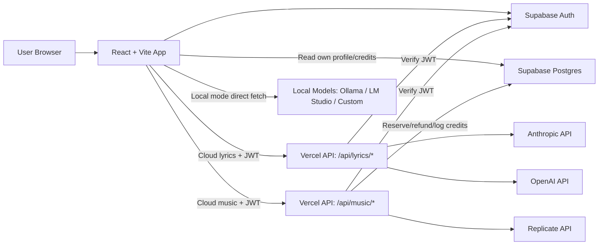
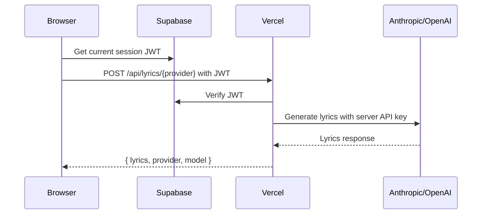
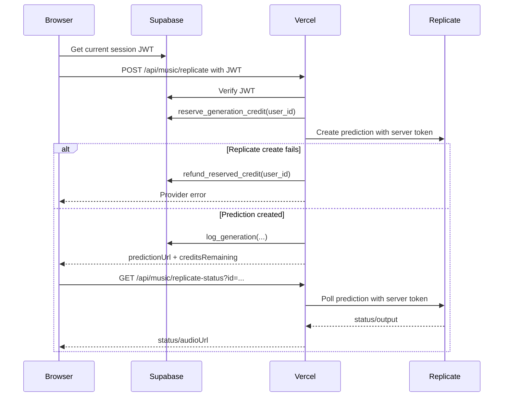

# LyricForge

LyricForge is a React app that turns a song idea into editable lyrics and generated audio. It uses Supabase for authentication and credits, Vercel Serverless Functions as secure provider proxies, Anthropic/OpenAI for lyrics, and Replicate for cloud music generation.

## Architecture



## How The Services Interact

The browser owns the user experience and stores only public or non-sensitive configuration. Supabase manages login sessions and exposes a user-scoped `profiles` row through Row Level Security. Vercel functions own all cloud provider calls because they need server-only API keys.

Cloud lyrics flow:



Cloud music flow:



Local provider flow:


Local mode bypasses Vercel and Supabase credit enforcement because it uses the user's own compute and local endpoint.

## Main Components

- `src/App.tsx`: Auth-gated application shell and generation orchestration.
- `src/components/ProviderPanel`: Cloud/local provider configuration.
- `src/components/IdeaInput.tsx`: Song idea and options.
- `src/components/LyricsEditor`: Editable, reorderable lyric sections.
- `src/components/AudioPlayer`: Custom dark-theme audio player.
- `src/client/lyrics`: Browser clients for cloud/local lyric generation.
- `src/client/music`: Browser clients for cloud/local music generation and Replicate polling.
- `api/lyrics/anthropic.ts`: Authenticated Anthropic proxy.
- `api/lyrics/openai.ts`: Authenticated OpenAI proxy.
- `api/music/replicate.ts`: Credit-gated Replicate prediction creation.
- `api/music/replicate-status.ts`: Authenticated server-side Replicate polling.
- `supabase/schema.sql`: Tables, RLS, auth trigger, and credit functions.

## Data Model

`profiles` stores the user's credit state:

- `id`: Supabase auth user id.
- `email`: user email.
- `credits_remaining`: free generation credits left.
- `credits_used`: successful cloud music generations.

`generation_log` records successful cloud music generations for debugging and audit.

Credit operations are handled by Postgres functions:

- `reserve_generation_credit(user_id)`: atomically decrements credits if available.
- `refund_reserved_credit(user_id)`: restores a reserved credit when provider creation fails.
- `log_generation(...)`: records successful prediction creation.
- `deduct_credit_and_log(...)`: compatibility helper for future synchronous providers.

## Security Model

- Browser-safe values use `VITE_`.
- Server secrets never use `VITE_`.
- Supabase publishable key is allowed in the browser.
- Supabase secret key, Anthropic key, OpenAI key, and Replicate token are server-only.
- Cloud API calls go through Vercel functions.
- Vercel functions verify the Supabase JWT before calling providers.
- Credits are enforced server-side through Supabase RPC functions.
- Local provider API keys are stored only in `sessionStorage`.
- `.env.local` is ignored by git.

## Environment Variables

Browser-safe:

```env
VITE_SUPABASE_URL=
VITE_SUPABASE_PUBLISHABLE_KEY=
```

Server-only:

```env
SUPABASE_URL=
SUPABASE_SECRET_KEY=

ANTHROPIC_API_KEY=
ANTHROPIC_MODEL=claude-sonnet-4-5-20250929

OPENAI_API_KEY=
OPENAI_MODEL=gpt-5.4-mini

REPLICATE_API_TOKEN=
REPLICATE_MUSICGEN_VERSION=d1787b4764f6cac4cd0a3d34eea716c1f04e683abce64828e03133775a79fb1f

PUBLIC_APP_URL=https://my-lyricforge.vercel.app
```

OpenAI variables are optional unless OpenAI is selected in the lyrics provider panel.

## First-Time Setup

1. Create a Supabase project.
2. Run `supabase/schema.sql` in the Supabase SQL Editor.
3. If needed, run `supabase/patch-service-role-grants.sql`.
4. Add Supabase auth URLs:
   - Site URL: `https://my-lyricforge.vercel.app`
   - Redirect URL: `https://my-lyricforge.vercel.app/auth/callback`
   - Local redirect URL: `http://localhost:3000/auth/callback`
5. Create `.env.local` from `.env.example`.
6. Fill in the required keys.
7. Run the app locally:

```bash
npm install
npm run dev:vercel
```

Use `npm run dev` only when you want frontend-only Vite development without Vercel API routes.

## Deployment

The project is intended to deploy through Vercel's GitHub integration.

1. Push to GitHub.
2. Connect the GitHub repo to the Vercel project.
3. Add the same environment variables in Vercel.
4. Use Vite settings:
   - Build command: `npm run build`
   - Output directory: `dist`
   - Install command: `npm install`
5. Push to `main`; Vercel deploys automatically.

## Useful Commands

```bash
npm run lint
npm run build
npx tsc --noEmit --ignoreConfig --target ES2022 --module NodeNext --moduleResolution NodeNext --types node --skipLibCheck api/_lib/*.ts api/lyrics/*.ts api/music/*.ts
```

The explicit API TypeScript check catches production-style Node ESM import problems in Vercel functions.
